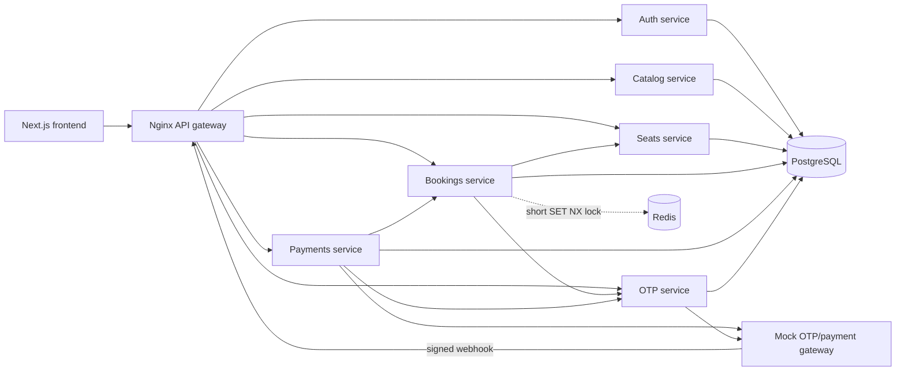

# CinemaSeat

CinemaSeat is a containerized cinema ticket-booking platform built with a Next.js frontend and Node.js microservices. It demonstrates safe seat reservation under concurrency, two-minute seat holds, OTP-protected payment, asynchronous payment webhooks, idempotency, Redis load shedding, and automated CI/CD.

## Features

- Browse movies, locations, showtimes, and seats.
- Register and log in with JWT-based authentication.
- Atomically hold one seat for 120 seconds.
- Prevent a user from holding multiple seats at the same time.
- Display the remaining hold time in the checkout UI.
- Send and verify payment OTP challenges through the supplied gateway.
- Process asynchronous payment results through signed webhooks.
- Prevent duplicate webhook processing and duplicate active bookings.
- Automatically release expired holds.
- View confirmed tickets from the user dashboard.
- Exercise concurrent booking with a k6 oversell test.
- Build only changed services in CI and deploy through a self-hosted runner.

## Architecture



| Component | Responsibility | Docker access |
|---|---|---|
| Frontend | Next.js booking interface | `http://localhost:3001` |
| API gateway | Public routing and CORS | `http://localhost:8080` |
| Auth service | Registration, login, JWT identity | Internal port `3000` |
| Catalog service | Movies and showtimes | Internal port `3000` |
| Seats service | Atomic holds, expiry, release, confirmation | Internal port `3000` |
| Bookings service | Booking saga and OTP request orchestration | Internal port `3000` |
| Payments service | OTP enforcement, charges, webhooks | Internal port `3000` |
| OTP service | OTP state, throttling, attempts, provider calls | Internal port `3000` |
| Mock gateway | OTP and payment-provider simulation | `http://localhost:9000` |
| PostgreSQL | Durable application state | `localhost:5432` |
| Redis | Five-second contention guard | `localhost:6379` |

## Booking and payment flow

1. The user selects a seat.
2. Bookings-service obtains a five-second Redis `SET NX` guard to shed duplicate load.
3. Seats-service uses a PostgreSQL transaction and atomic conditional update to change the seat from `AVAILABLE` to `HELD`.
4. A PostgreSQL advisory transaction lock ensures the same user cannot hold a different seat concurrently.
5. The hold receives a server-side expiry time, 120 seconds by default.
6. Bookings-service creates an idempotent booking and asks OTP-service to send a payment OTP.
7. Payments-service verifies the OTP on the server; the browser cannot bypass this step.
8. Payments-service creates an idempotency key and submits a numeric amount to the payment gateway.
9. The gateway later sends a signed webhook.
10. Payments-service deduplicates the event, then bookings-service confirms or cancels the booking and updates the seat.
11. If checkout is not completed, seats-service sweeps the expired hold and marks its booking `EXPIRED`.

PostgreSQL is the correctness boundary. Redis is only an optimization: booking remains safe if Redis is unavailable.

## Technology stack

- Next.js 16, React 19, TypeScript
- Node.js, Express
- PostgreSQL 15
- Redis and ioredis
- Nginx API gateway
- Docker Compose
- GitHub Actions
- k6 load testing

## Prerequisites

- Docker Engine with Docker Compose v2
- Git
- Optional for non-Docker development: Node.js 20 or newer, PostgreSQL, and Redis
- Optional for load tests: k6

## Quick start with Docker

Clone the repository and enter it:

```bash
git clone https://github.com/tawhidislam22/CinemaSeat-backend.git
cd CinemaSeat-backend
```

Create the local environment file:

```bash
cp .env.example .env
```

At minimum, replace the example secrets in `.env`:

```dotenv
JWT_SECRET=replace-with-a-long-random-value
OTP_INTERNAL_SECRET=replace-with-another-long-random-value
GATEWAY_SECRET=replace-with-the-gateway-signing-secret
HOLD_TTL_SECONDS=120
MOCK_GATEWAY_MODE=deterministic
```

Start the stack:

```bash
docker compose up -d --build
docker compose ps
```

Open:

- Frontend: `http://localhost:3001`
- API gateway: `http://localhost:8080`
- Mock gateway health: `http://localhost:9000/health`

Follow logs:

```bash
docker compose logs -f
```

Stop the stack without deleting database data:

```bash
docker compose down
```

To remove the PostgreSQL volume as well:

```bash
docker compose down -v
```

The `-v` command permanently deletes local database data.

## Configuration

| Variable | Purpose | Typical Docker value |
|---|---|---|
| `DATABASE_URL` | PostgreSQL connection string | Injected per service by Compose |
| `REDIS_URL` | Redis connection used by bookings-service | `redis://redis:6379` |
| `JWT_SECRET` | JWT signing secret | Required secret |
| `OTP_INTERNAL_SECRET` | Protects internal OTP endpoints | Required secret |
| `GATEWAY_SECRET` | Verifies payment webhook HMAC signatures | Must match gateway |
| `GATEWAY_URL` | OTP/payment provider base URL | `http://mock-gateway:9000` |
| `CALLBACK_URL` | Provider-accessible payment webhook URL | `http://api-gateway:80/webhooks/payment` |
| `SEATS_SERVICE_URL` | Internal seats-service URL | `http://seats-service:3000` |
| `BOOKINGS_SERVICE_URL` | Internal bookings-service URL | `http://bookings-service:3000` |
| `PAYMENTS_SERVICE_URL` | Internal payments-service URL | `http://payments-service:3000` |
| `OTP_SERVICE_URL` | Internal OTP-service URL | `http://otp-service:3000` |
| `HOLD_TTL_SECONDS` | Seat hold duration | `120` |
| `SWEEP_INTERVAL_MS` | Expired-hold cleanup interval | `10000` |
| `DB_POOL_MAX` | Seats-service PostgreSQL pool size | `10` |
| `MOCK_GATEWAY_MODE` | `deterministic` for predictable local behavior | `deterministic` |
| `NEXT_PUBLIC_*_URL` | Browser-visible backend base URLs | Public API gateway URL |

Never commit a real `.env` file. If the database credential currently present in `.env.example` is genuine, rotate it immediately and replace it with a placeholder.

### Mock gateway modes

Use deterministic mode during normal development:

```dotenv
MOCK_GATEWAY_MODE=deterministic
```

The deterministic OTP is `123456`. Leave the value empty when testing delayed delivery, lost OTPs, gateway errors, duplicate callbacks, and other resilience behavior.

View gateway activity and delivered mock OTPs with:

```bash
docker compose logs -f mock-gateway
```

OTP values must never be logged by production authentication or OTP services.

## API overview

All browser and external requests should use the API gateway at `http://localhost:8080`. Backend containers communicate using Compose service names.

### Authentication

| Method | Route | Purpose |
|---|---|---|
| `POST` | `/auth/register` | Register a user |
| `POST` | `/auth/login` | Log in and receive a JWT |
| `GET` | `/auth/me` | Return the authenticated user |

Register example:

```bash
curl -X POST http://localhost:8080/auth/register \
  -H "Content-Type: application/json" \
  -d '{"name":"Demo User","phone":"01711111111","password":"change-me"}'
```

### Catalog and seats

| Method | Route | Purpose |
|---|---|---|
| `GET` | `/catalog/movies` | List movies |
| `GET` | `/catalog/shows/:movieId` | List shows for a movie |
| `GET` | `/seats/:showId` | Fetch a show seat map |
| `POST` | `/seats/hold` | Internal atomic seat hold |
| `POST` | `/seats/release` | Internal seat release |
| `POST` | `/seats/confirm` | Internal booking confirmation |

### Bookings and payments

| Method | Route | Purpose |
|---|---|---|
| `GET` | `/bookings/active-hold?userId=...` | Restore the user's current hold |
| `POST` | `/bookings/hold` | Hold a seat and request payment OTP |
| `POST` | `/bookings/:bookingRef/resend-otp` | Request another payment OTP |
| `GET` | `/bookings/my-tickets?userId=...` | List confirmed tickets |
| `POST` | `/payments/charge` | Verify OTP and initiate payment |
| `POST` | `/webhooks/payment` | Receive a signed provider callback |

Hold a seeded seat:

```bash
curl -X POST http://localhost:8080/bookings/hold \
  -H "Content-Type: application/json" \
  -d '{
    "showId":"dddd0000-0000-0000-0000-000000000001",
    "seatId":"cccc0000-0000-0000-0000-000000000001",
    "userId":"11111111-1111-1111-1111-111111111111",
    "phone":"01711111111"
  }'
```

Verify the payment OTP and initiate payment:

```bash
curl -X POST http://localhost:8080/payments/charge \
  -H "Content-Type: application/json" \
  -d '{"bookingRef":"bk_REPLACE_ME","otpCode":"123456"}'
```

An accepted charge returns HTTP `202`. Final success arrives asynchronously through the webhook.

## Manual development without Docker

Docker Compose is the recommended workflow because it supplies service discovery and dependencies. For manual development, start PostgreSQL, Redis, and the mock gateway first, then run each service with a unique port.

Example Git Bash commands:

```bash
# Terminal 1: mock gateway
cd /e/CinemaSeat
PORT=9000 node app/server.js

# Terminal 2: seats
cd /e/CinemaSeat/services/seats-service
PORT=3002 node src/index.js

# Terminal 3: bookings
cd /e/CinemaSeat/services/bookings-service
PORT=3003 node src/index.js

# Terminal 4: payments
cd /e/CinemaSeat/services/payments-service
PORT=3004 CALLBACK_URL=http://localhost:3004/webhooks/payment node src/index.js

# Terminal 5: OTP
cd /e/CinemaSeat/services/otp-service
PORT=3005 node src/index.js

# Terminal 6: auth
cd /e/CinemaSeat/services/auth-service
PORT=3006 node src/index.js

# Terminal 7: catalog
cd /e/CinemaSeat/services/catalog-service
PORT=3001 node src/index.js

# Terminal 8: frontend
cd /e/CinemaSeat/frontend
npm run dev
```

The frontend's local fallbacks use direct service ports. In Docker and production, set every `NEXT_PUBLIC_*_URL` to the API gateway.

## Database

On first startup, PostgreSQL runs:

1. `db/init/00-schemas.sql`
2. `db/init/01-extensions.sql`
3. `db/init/02-seed.sql`

The schema includes users, movies, theatres, screens, shows, seats, seat status, bookings, payments, processed webhook events, and OTP verification records.

Important database safeguards include:

- Primary key on `(seat_id, show_id)` for seat state.
- Conditional update from `AVAILABLE` to `HELD`.
- Unique active-booking index for each show and seat.
- Unique payment idempotency keys.
- Primary key on processed webhook event IDs.
- Transactions and advisory locks for one-active-hold-per-user behavior.

Initialization scripts run only when the database volume is empty. To reinitialize local seed data, remove the volume with `docker compose down -v`, then start the stack again.

## Testing

### Health and smoke checks

```bash
curl http://localhost:8080/health
curl http://localhost:9000/health
docker compose ps
```

### Oversell load test

The k6 scenario sends 100 concurrent hold attempts for the same seeded seat:

```bash
k6 run load-tests/scenario-a-oversell.js
```

The expected result is one successful hold and conflicts for competing attempts; the seat must never be sold twice.

### Frontend checks

```bash
cd frontend
npm ci
npm run lint
npm run build
```

## CI/CD

The GitHub Actions workflows are under `.github/workflows/`:

- `ci.yml` detects changed components and builds their Docker images.
- `cd.yml` runs on pushes to `main` using a self-hosted runner, validates Compose, rebuilds the stack, and removes orphan containers.

The deployment runner must:

- Have Docker and Docker Compose v2 installed.
- Be able to access the Docker daemon directly or through passwordless `sudo docker`.
- Contain the required production environment values.
- Reach the Poridhi load balancer and other deployment dependencies.

Frontend `NEXT_PUBLIC_*` values are compiled into the browser bundle at build time. Changing only the runtime container environment is insufficient; rebuild the frontend image after changing them.

See [CI/CD documentation](docs/ci-cd.md) and the [pipeline diagram](docs/pipeline-diagram.md).

## Production deployment notes

- Replace all development secrets.
- Use a strong `JWT_SECRET` and `OTP_INTERNAL_SECRET`.
- Keep the database and internal services private.
- Expose only the frontend and API gateway.
- Configure the exact frontend origin in Nginx CORS headers.
- Make `CALLBACK_URL` reachable from the payment provider.
- Ensure `GATEWAY_SECRET` matches the provider's webhook signing secret.
- Set all frontend public service URLs to the public API gateway.
- Use HTTPS for public traffic.
- Do not use deterministic OTP mode or log OTP codes in production.
- Avoid mutable image tags such as `latest` for reproducible production deployments.

The current Compose file contains deployment-specific Poridhi URLs. Replace them with your own public API gateway URL before deploying elsewhere.

## Troubleshooting

### Browser receives `ERR_CONNECTION_REFUSED`

The target service or gateway is not listening. For Docker, use `http://localhost:8080` and check:

```bash
docker compose ps
docker compose logs --tail=100 api-gateway payments-service
```

### Login returns 404

Confirm Nginx preserves `/auth/` when proxying. The auth service implements `/auth/login`, not `/login`.

### Payment returns 502

Inspect both services:

```bash
docker compose logs --tail=100 payments-service mock-gateway
```

The gateway requires `amount` to be a positive JSON number. PostgreSQL `NUMERIC` values arrive in Node.js as strings, so payments-service converts the value before sending it.

### Seat hold returns 409

This normally means the seat is unavailable, another request is processing it, or the user already has an active hold. Complete the existing booking or wait for the server-side timer to expire.

### Sweeper reports a terminated PostgreSQL connection

Check database availability and the connection string. Seats-service handles idle pool errors and retries the next non-overlapping sweep automatically.

### OTP is not visible

In deterministic development mode, use `123456` and watch:

```bash
docker compose logs -f mock-gateway otp-service
```

### A manual change disappears after deployment

The CD runner checks out the Git repository and rebuilds it. Commit and push configuration changes instead of editing only the deployment VM.

## Repository structure

```text
CinemaSeat/
├── .github/workflows/       CI and CD workflows
├── app/server.js            Local full-featured mock gateway
├── db/                      Schema, seed, and database utilities
├── docs/                    Architecture and deployment documentation
├── frontend/                Next.js application
├── gateway/                 Nginx API gateway
├── load-tests/              k6 concurrency scenarios
├── monitoring/              Prometheus configuration
├── services/
│   ├── auth-service/
│   ├── bookings-service/
│   ├── catalog-service/
│   ├── otp-service/
│   ├── payments-service/
│   └── seats-service/
├── docker-compose.yml
└── DECISIONS.md             Architectural decisions and trade-offs
```

## Additional documentation

- [Architecture](docs/architecture.md)
- [CI/CD setup](docs/ci-cd.md)
- [Pipeline diagram](docs/pipeline-diagram.md)
- [Architectural decisions](DECISIONS.md)

## License

The root package currently declares the ISC license. Add a repository-level `LICENSE` file before public distribution if required.
