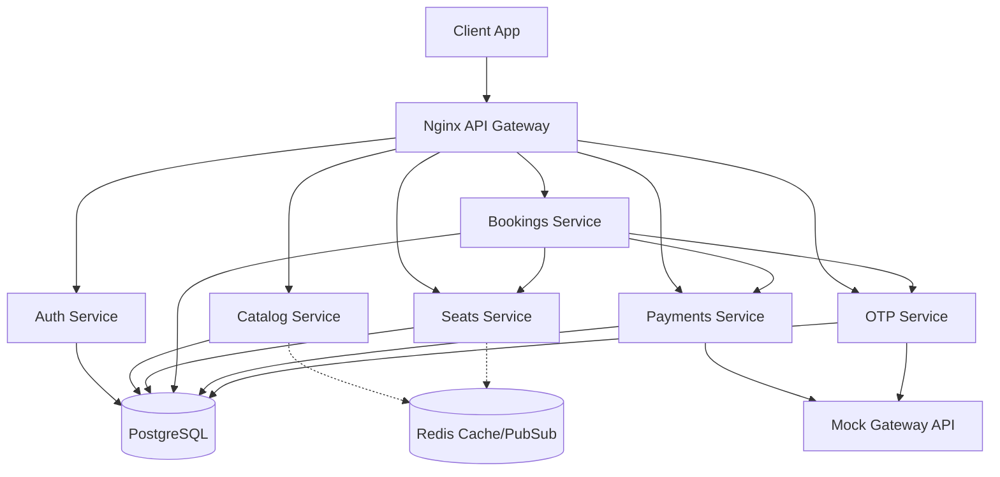

# CinemaSeat Architecture

## Rubric Mapping
- **Milestone 1 (Foundations):** Clean architecture using Node.js for microservices and Nginx as the gateway. Fully containerized with `docker-compose.yml`.
- **Milestone 2 (Atomic Hold):** Implemented in `seats-service` using a single-row atomic `UPDATE` with row-level locking.
- **Milestone 3 (Sagas/Pipelines):** The orchestrator is in `bookings-service`. Webhooks hit `payments-service`, which verifies idempotency before notifying `bookings-service`. CI/CD pipelines added in `.github`.
- **Milestone 4 (Load Testing):** K6 load test script provided in `load-tests/` to guarantee no overselling on the hot path.
