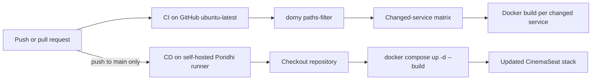

# CI/CD Pipeline

## Execution model

- Pull requests and pushes to `main` run CI on GitHub-hosted runners.
- CI detects changes across the six backend services, frontend, and gateway, then builds only the affected Docker images.
- Pushes to `main` also trigger CD on the Poridhi VM's self-hosted runner.
- CD deploys directly with Docker Compose; it does not require SSH connectivity or deployment secrets.
- The deployment concurrency group prevents two production deployments from running simultaneously.

After CI succeeds at least once, configure the `main` branch protection rule to require the CI `build` status before merging.
